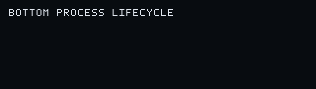

# bottom — process history for your terminal

[](https://github.com/donomii/bottom/actions/workflows/test.yml)
[](https://github.com/donomii/bottom/actions/workflows/release.yml)

`top` shows what is running. `bottom` shows what ran.

Bottom is a read-only process lifecycle flight recorder for transient commands, restart loops, and process ancestry. It records start, exec, stop, churn, and capture-gap events to the terminal, JSONL, CSV, or an interactive timeline.



This is the lifecycle recorder at [donomii/bottom](https://github.com/donomii/bottom), not the current-state system monitor at [ClementTsang/bottom](https://github.com/ClementTsang/bottom). Release archives use the `bottom-events` package name while retaining the `bottom` command.

## Install

Tagged releases publish checksummed Linux, macOS, and Windows binaries for amd64 and arm64 at [https://github.com/donomii/bottom/releases](https://github.com/donomii/bottom/releases).

Install with Homebrew:

```fish
brew install donomii/tap/bottom-events
```

Install with Scoop:

```text
scoop bucket add donomii https://github.com/donomii/scoop-bucket
scoop install bottom-events
```

Install from source with Go 1.25 or newer:

```fish
go install github.com/donomii/bottom@latest
```

The executable is installed in `GOBIN`, or in the `bin` directory under the path reported by `go env GOPATH` when `GOBIN` is unset. Add that directory to `PATH` to invoke `bottom` by name.

From a checkout:

```fish
./run.sh
```

`run.sh` accepts the same options and commands as `bottom`.

## Start in 30 seconds

Print process history to the terminal:

```fish
bottom
```

Watch interactively while recording to JSONL:

```fish
bottom -tui -format jsonl -output bottom.jsonl
```

Find short-lived processes that exited with code 1 during the last 15 minutes:

```fish
bottom query -input bottom.jsonl -events stop -since 15m -max-duration 5s -exit-code 1
```

Trace only a command and its descendants, then create a Perfetto timeline:

```fish
bottom trace -output build.jsonl -perfetto build-trace.json -- make test
```

Summarize, replay, or compare recordings:

```fish
bottom report -input bottom.jsonl
bottom replay -input bottom.jsonl -tui -speed 4
bottom compare -before previous.jsonl -after current.jsonl
```

## What Bottom records

- Best available process identity, PID, parent PID, executable, command, owner, first observation, and OS start time; PID-only fallbacks are identified in the platform table.
- Parent ancestry captured before short-lived parents disappear.
- Linux UID, TTY, session, cgroup, systemd unit, and container identity when visible.
- Exit status when supplied by the backend.
- Structured capture gaps and backend transitions so detected losses are explicit.
- Versioned JSONL and CSV metadata for session, host, boot, sequence, schema, source timestamp, and observation timestamp.
- Semantic restart churn grouped by executable, parent, owner, service, and container rather than volatile arguments.

Text output uses full timestamps and one event per line:

```text
2026-07-09T12:00:01.123-07:00 start session=... seq=1 backend=poll process=421:... pid=421 ppid=22 uid=1000 user=jer exe="/usr/bin/compiler" cwd="/work" unit="" container="" cmd="compiler --input main.go" parent=22:shell
2026-07-09T12:00:01.206-07:00 stop  session=... seq=2 backend=poll process=421:... pid=421 ppid=22 duration=83ms exit=0 uid=1000 user=jer exe="/usr/bin/compiler" unit="" container="" cmd="compiler --input main.go"
2026-07-09T12:00:03.000-07:00 churn session=... seq=9 backend=poll count=5 window=10s exe="/usr/bin/compiler" unit="builder.service" container="" cmd="compiler --input main.go"
```

## Commands

### `bottom` or `bottom record`

Continuously record process lifecycle events. `bottom watch` is an alias.

Capture and output:

- `-backend auto` chooses the native event source for the current platform and otherwise uses native snapshot polling. Explicit values are `auto`, `poll`, `linux-proc-connector`, `windows-etw`, and `macos-endpoint-security`.
- `-poll 100ms` sets the polling fallback interval.
- `-format text` selects `text`, `jsonl`, or `csv` output.
- `-output PATH` appends to an owner-only output file; empty writes to stdout.
- `-tui` shows the interactive timeline. When `-output` is set, the same events are recorded simultaneously.
- `-recorder-buffer 1024` bounds queued writes; a full queue stops with an accurate backpressure error rather than losing events silently.
- `-rotate-size 0` rotates text, JSONL, or CSV after this many bytes; zero disables size rotation.
- `-rotate-interval 0` rotates text, JSONL, or CSV after this duration; zero disables time rotation.
- `-redact TEXT` replaces exact matching text with `[REDACTED]` before any output; repeat it for multiple values. The default performs no rewriting.

Filtering:

- `-events all` keeps `start`, `exec`, `stop`, `churn`, `gap`, `all`, or the backward-compatible `both` alias.
- `-include TEXT` keeps events whose searchable fields contain the text; repeat values are ORed.
- `-exclude TEXT` removes matching events; repeat values are ORed.
- `-include-regex EXPRESSION` and `-exclude-regex EXPRESSION` apply case-sensitive regular expressions to the original-case searchable fields.
- `-user USER` matches a user name or numeric UID.
- `-ppid PID` matches the immediate parent.
- `-ancestor-pid PID` matches any captured ancestor.
- `-cwd TEXT`, `-exe TEXT`, `-container TEXT`, and `-unit TEXT` filter their corresponding fields.
- `-min-duration 0` and `-max-duration 0` limit stop events by lifetime; zero leaves that bound disabled.

Capture-gap records always reach live outputs even when an ordinary process or event-kind filter would reject them, so filtering cannot make coverage appear complete.

Restart-loop detection:

- `-churn-window 10s` sets the sliding restart window.
- `-churn-threshold 5` sets the number of short lifetimes needed for a report.
- `-churn-cooldown 10s` sets the minimum interval between sustained reports for the same group.
- `-churn-max-keys 4096` bounds retained process groups and evicts the oldest group when full.
- `-churn-max-life 5s` sets the longest lifetime considered a restart; zero counts starts without waiting for stops.

Triggered recording:

- `-ring-buffer 0` retains this many pre-trigger events instead of writing immediately; zero disables triggered recording.
- `-trigger churn` selects `churn`, `gap`, `failed-exit`, or `regex:EXPRESSION`.
- `-post-trigger 10s` records this much activity after a trigger. Later triggers extend the window.

Trigger decisions see the unfiltered event stream. Only events accepted by the output filters, plus mandatory capture gaps, reach the recording.

Utilities:

- `-h` prints help for recording, trace, query, replay, report, or compare and exits successfully; `bottom trace -h` does not require a `--` command boundary.
- `-version` prints the build version, source commit, and build date, then exits.
- `-test` runs deterministic built-in checks and exits.

Tagged archives inject all version fields. Source-installed and checkout builds fall back to the Go module version and VCS revision when available; their build date remains `unknown` unless injected by the builder.

### `bottom trace`

Runs the command after the required `--`, records only that process and discovered descendants, and never acts on unrelated processes.

- `-format jsonl` and `-output bottom-trace.jsonl` select the recording by default.
- `-poll 10ms` sets descendant discovery frequency.
- `-tail 2s` limits observation of surviving descendants after the root command exits; Bottom records a gap if the tail ends while descendants remain.
- `-perfetto PATH` writes a new owner-only Perfetto-compatible JSON timeline. Empty disables export and its in-memory event retention. The recording and Perfetto paths must resolve to different files.
- `-redact` and `-recorder-buffer` behave as in recording mode.

Trace rejects `-tui` because the traced command shares the terminal. Record to a file and use `bottom replay -tui` afterward. Once the command starts, Bottom waits for its natural exit even if recording fails; it does not alter the command or surviving descendants.

### `bottom query`, `bottom replay`, and `bottom report`

These commands stream `-input bottom.jsonl` without changing it. An output path that resolves to the input file is rejected.

- `-since` and `-until` accept RFC3339 timestamps or durations before now such as `15m`.
- `-exit-code CODE` matches an exact exit code, including zero.
- The recording filters listed above are available for event kind, text, regex, owner, ancestry, context, and lifetime.
- `-limit 0` bounds matching events when non-zero.
- Query supports `-format text`, `jsonl`, or `csv` and optional `-output`.
- Replay uses `-speed 1`, `-max-delay 1s`, and optional `-tui`. A zero maximum delay preserves the full recorded timing.
- Report shows event totals, coverage gaps, failures, top executables, parent fan-out, ancestry edges, and shortest lifetimes.

### `bottom compare`

`-before before.jsonl` and `-after after.jsonl` are opened read-only and compare process fingerprints, ancestry, counts, failures, and average lifetimes. `-output` appends the report to an owner-only file; empty writes to stdout and paths resolving to either input are rejected.

## Interactive controls

TUI navigation keys act immediately:

- `p` pauses or resumes rendering while collection continues.
- `k` and `j` move toward older and newer events.
- `/` edits a search for event kind, process identity, command, executable, working directory, owner, context, PID, message, and captured ancestry fields. Return applies it, Escape cancels it, Backspace deletes, and Ctrl-U clears the draft.
- `x` clears the active search.
- `d` toggles details for the selected event.
- `c` cycles command, context, and executable column layouts.
- `s` cycles timeline, duration, PID, and command ordering.
- Ctrl-C or Ctrl-D stops Bottom itself without acting on any monitored process.
- `?` toggles control help.

The display adapts its rows and command width to terminal resizing. If raw terminal input is unavailable, the same controls remain available as line commands followed by Return; use `columns` and `sort` for those two cycles.
The status line reports the active backend, capture gaps, pause state, search, scroll position, columns, and ordering.
Process-supplied terminal control bytes are displayed as visible hexadecimal escapes rather than executed by the terminal.

## Platform support

| Platform | Default source | Stable identity | Command line | Owner | Native event stream |
|---|---|---:|---:|---:|---:|
| Linux | Process connector with direct `/proc` fallback | Yes | Yes | UID and resolved name | Yes when the connector is available |
| macOS | Endpoint Security with native `sysctl` fallback | Yes | Yes when visible | UID and resolved name | Yes when the signed binary has Apple's entitlement, Full Disk Access, and required privilege |
| Windows | ETW with native Tool Help fallback | Yes when creation time is readable; PID fallback otherwise | Yes when visible; executable fallback | SID and resolved account name | Yes when ETW session creation is permitted |
| Other Unix | `ps` snapshot fallback | PID only | Yes | Yes | No |

Native event modes record direct lifecycle events, exact exit status when supplied, detected losses, and periodic snapshot reconciliation. If native setup fails in `auto` mode, Bottom writes a structured backend-transition gap and continues with platform-native polling. The macOS requirements and signing procedure are documented in [docs/endpoint-security.md](docs/endpoint-security.md).

Snapshot backends can miss a process that starts and exits entirely between snapshots. After capture starts, they emit structured gaps when a snapshot itself fails, but that cannot prove complete coverage between successful snapshots. An initial snapshot failure stops before capture. Use the Linux connector when complete short-process capture matters.

## Recording formats and privacy

JSONL and CSV contain versioned session start/end records plus event and gap records. JSONL is the canonical format for query, replay, report, and comparison workflows.

New output files use mode `0600` on Unix. Existing destination permissions are preserved. Command arguments can contain credentials; use repeated `-redact` values when exact sensitive text must not be stored. Structural fields such as event kind, backend, and session identifiers are not rewritten because doing so would break queries and coverage classification.

## Why Bottom

| Tool category | Primary question |
|---|---|
| `top`, `htop`, and current-state dashboards | What is running now and consuming resources? |
| [pspy](https://github.com/DominicBreuker/pspy) | What transient commands appeared on Linux? |
| [forkstat](https://github.com/ColinIanKing/forkstat) | What fork, exec, and exit activity occurred on Linux? |
| Bottom | What ran over time, who spawned it, how long did it live, where are the gaps, and how do two recordings differ? |

Bottom deliberately does not duplicate CPU, RAM, disk, or network dashboards.

Read-only means Bottom does not terminate, suspend, inject into, or otherwise alter monitored processes. Recording modes can write the output files requested by the user, and trace mode starts only the command explicitly supplied after `--`.

## Build, test, benchmark, and install

```fish
./build.sh
./test.sh
./benchmark.sh
./demo.sh
./install.sh
```

- `build.sh` creates the `bottom` binary.
- `test.sh` runs the Go tests and built-in checks.
- `benchmark.sh` measures burst snapshot diffing and bounded high-cardinality churn handling.
- `demo.sh` traces a finite self-test, writes JSONL and Perfetto recordings, and prints an ancestry report plus the artifact paths.
- `install.sh` installs the command with `go install`.

GitHub Actions tests Linux, macOS, and Windows, runs natural-exit lifecycle smoke checks, the Go race detector, and a portable release/SBOM snapshot. Tags matching `v*` run the release workflow and produce `bottom-events` archives with checksums, SPDX JSON SBOMs, and GitHub provenance attestations.

See [CONTRIBUTING.md](CONTRIBUTING.md), [SPEC.md](SPEC.md), [CHANGELOG.md](CHANGELOG.md), [SECURITY.md](SECURITY.md), and [docs/repository-settings.md](docs/repository-settings.md).
